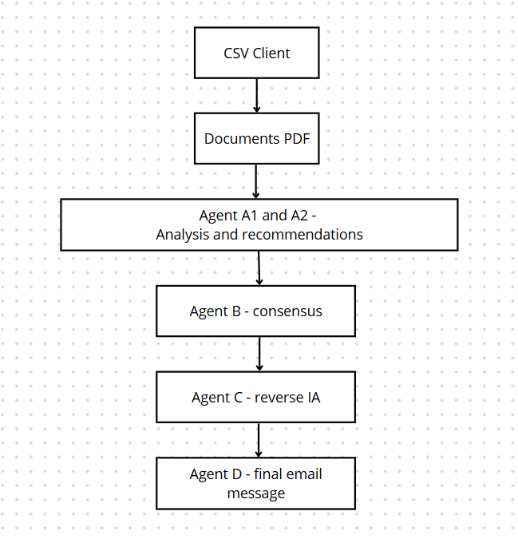

# Hackathon-ESSEC-Eika

Team members : Emma LEGRAND (EMLV), Antoine VANSIELEGHEM (ESILV), Kylie WU (ESILV), Ilan ZINI (ESILV)

Hackaton Track : Industry

Today, most insurance contracts evolve on fixed dates, with little consideration for the actual life events of the customer.
Our solution (B2B) introduces an intelligent AI system that detects key life moments, such as moving to a new home, having a child, or switching to remote work, and automatically triggers a targeted review of the customer’s insurance contract.
The result : the customer is better protected, right when it matters.
The insurer strengthens loyalty while increasing the relevance and timing of new offers.

### Market Context
The AI market in the insurance sector is expanding rapidly. According to a KPMG study, the global AI market in insurance could reach $79 billion by 2032, reflecting substantial growth potential. Insurance companies must prepare for this increase in their customer base and be ready to offer solutions that meet their clients' needs.

More and more insurers recognize the benefits of AI in improving operational efficiency and customer experience. Companies like Generali, MAIF, and AXA have already started integrating AI to offer optimized services.

AI enables personalized product recommendations based on customer data, an automation of tasks like claims handling and underwriting and a better risk assessment and customer retention.

However, challenges remain around data quality, ethics, and compliance.

Unlike competitors focused on claims or underwriting, AssurFlow provides real-time, proactive insurance recommendations to sales agents based on life events (for instance : moving, retirement, having a child). Instead of introducing yet another tool or overwhelming agents with unnecessary information, our solution presents tailored recommendations directly within their CRM. Sales agents can choose to act on these insights and contact the customer or disregard them based on their own assessment.

### Database
We used a customer database from Kaggle (https://www.kaggle.com/datasets/stealthtechnologies/regression-dataset-for-household-income-analysis). We completed it by filling it with more columns and fictional life events (for instance buying a home, having a child, changing jobs). Based on these events, the system generates personalized insurance recommendations, such as : "Your client X just purchased a home — consider offering them a tailored home insurance plan." 

To see the detail of each column : see the PDF document named "Explanations about each columns of the clients dataset".

### Architecture

### Components
1. **Database**  
   - Customer data stored in **AWS S3** and **Redshift**.  
   - Enriched with fictional life events for testing purposes.  

2. **AI Agents**  
   - Powered by **Amazon Bedrock** (Claude 3.5, Mistral...) and orchestrated using Python.  
   - Agents analyze customer data and generate actionable recommendations thanks to information about the different types of insurance contracts and details (see the PDF document).  

3. **Backend**  
   - Orchestrates data flow between the database, AI agents, and frontend.  
   - Built with Python, leveraging **boto3** for AWS integration.  

4. **Frontend**  
   - Interactive web application built with **Streamlit**.  
   - Supports two user roles:  
     - **Clients :** View and update their profiles, simulate life events.  
     - **Advisors :** Access client updates, receive AI-driven recommendations.  

## Features

### AI-Powered Recommendations
- Detects life events (for instance : moving, having a child...) and suggests tailored insurance products.  
- Recommendations are delivered directly within the advisor's CRM for seamless integration.  

### Interactive Web Application
- **Clients**  
  - Log in to view and update their profiles.  
  - Simulate life changes to explore potential insurance adjustments.  
- **Advisors**  
  - Access a dashboard with client updates and AI-generated recommendations.  
  - Trigger AI agents for contextual insights.  

### Data Persistence
- Streamlit's data persistence feature ensures instant updates to the application.  

### Business model
Our AI solution requires an initial investment covering development, CRM integration, cloud infrastructure, and customer support. To ensure sustainability, we adopt a hybrid model combining setup fees, subscriptions, and additional monetization.
Insurers pay a one-time integration fee based on implementation complexity. Each agent using the AI subscribes to a monthly plan, ensuring predictable revenue.

To offset potential lossesfo insurrance company from contract adjustments, we offer a premium option that provides continuous monitoring and personalized recommendations. The AI also enhances cross-selling by suggesting complementary policies, increasing revenue per customer while boosting retention.

This model delivers strong value to insurers while generating a stable, diversified revenue stream, reshaping the insurance experience for all stakeholders.

### UX/UI prototype (Figma)
[https://www.figma.com/proto/9PYtKRSmSfxNUBcYdC8OR6/Assur-Flow-Prototype-dev-version?node-id=0-1&t=ZEaL5GMef2NjhYB3-1](https://www.figma.com/proto/9PYtKRSmSfxNUBcYdC8OR6/Assur-Flow-Prototype-dev-version?node-id=0-1&t=ZEaL5GMef2NjhYB3-1)

### Enhancements
1. **Frontend**  
   - Transition from Streamlit to **React** for a more scalable and responsive UI.  
   - Implement API-based communication between frontend and backend.  

2. **AI Models**  
   - Expand the range of AI agents to include advanced NLP models for better customer insights.  

3. **Data Security**  
   - Strengthen data encryption and compliance with GDPR and other regulations.  

4. **Scalability**  
   - Optimize the architecture for handling larger datasets and higher user traffic.  
